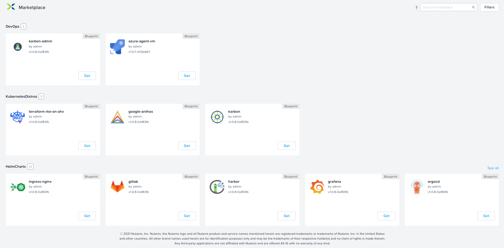
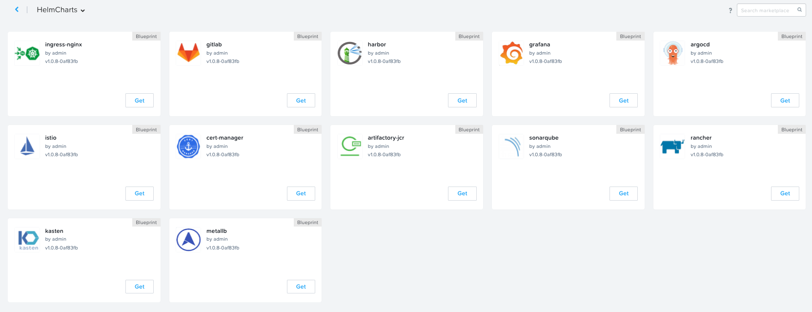
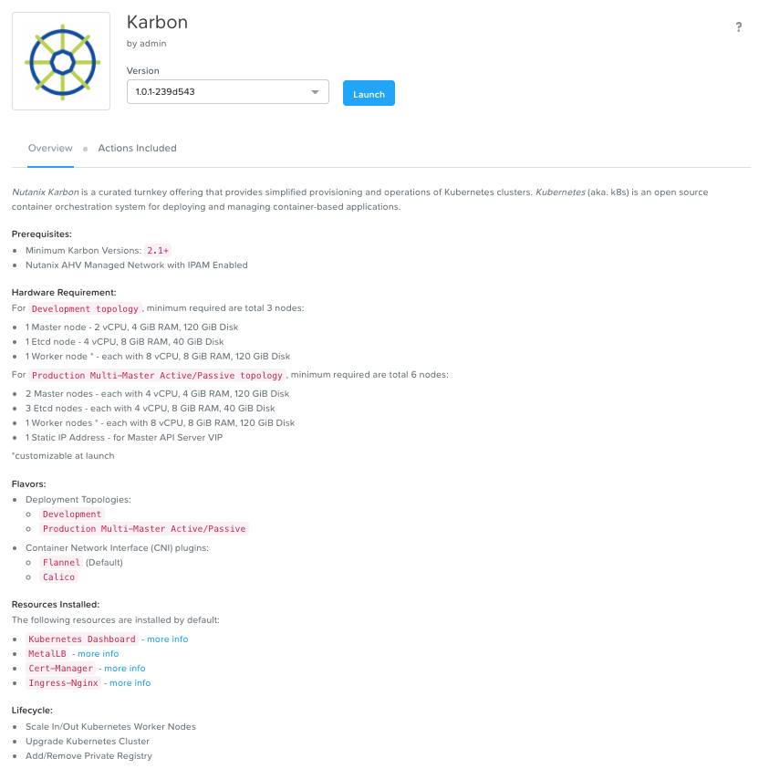

# Cloud Native Focused - Nutanix Cloud Management [NCM] on Nutanix Kubernetes Engine [NKE] Blueprints

The purpose of this repo is to seed any Nutanix Prism Central environment with a collection of curated Calm Blueprints used to standup a production ready Kubernetes distribution and subsequently customize it with one of the many kubernetes applications that are available in the Self-Service Marketplace items

This repo was built after our team had issues with the shared cluster being used for demonstrations.  These types of issues lead to critical customer meeting cancellations and a significant loss of time / productivity.

In any case, as I was porting our existing stuff to some interim cluster, I realized that this will most likely not be the last time that this will happen, so in light of being a considerate `infrastructure as code` citizen, I decided to treat the demo lab more like a "cattle" environment versus a "pet".

## What is the purpose of this repo?

Since many customers are very visual and prefer to see the technologies they have in-house being leveraged for the underlying demo / presentation, we went ahead and began developing a curated listed of blueprints that could deploy some the most highly requested cloud-native technologes using Helm Kubernetes package manager.

Alternatively, having a space that is highly transient and ephemeral in nature lends to being an environment where folks can do highly destructive testing with no fear or hesitation...goes without saying - `FAILING FAST is instrumental to lean, repeatable and qualitative results!!`

### 1. NKE Focused - Helm Chart Marketplace

Since this repository is highly focused on Nutanix NKE and Calm integration, the goal was to be able to provide a means of deploying the respective Helm charts on any NKE Cluster that is currently deployed into the respective Prism Central instance.  The only pre-requisite is that the running cluster already has MetalLB, Ingress and Cert-Manager.  Alternatively, one can demo the Calm blueprint that actually deploys the underlying NKE cluster with all the pre-requisites already deployed / configured.

1. Curated list of Helm Chart Deployments of various cloud-native solutions (vetted as part of the CNCF) that have allowed us to quickly plug and play based on customer needs
1. All Helm Chart Blueprints fully published to Calm Marketplace, with option to only create / publish each blueprint independently.
1. Each Helm Chart is designed to be easily deployed onto any NKE cluster, with HTTPS and Ingress fully configured using optional Wildcard DNS.
1. In certain cases, Helm Charts are deployed and configured with advanced scenarios to demonstrate real world use cases. (i.e., Deploy JFrog Container Registry -> Configure Docker and Helm Repositories -> Configure NKE Private Registry)

### 2. NKE Cluster Deployment Blueprint

The purpose of this blueprint was to demonstrate how customers can leverage Calm and the underlying NKE APIs to easily Deploy either a Development and/or Production Cluster, while also laying down the base components needed to be productive with well-known NKE/kubernetes command line utilities with a development workstation and lastly, deploying the MetalLB, Cert-Manager and Ingress components needed for most underlying Helm Charts.

### 3. Alternative CNCF Certified - Managed Kubernetes Distributions

The purpose of these blueprints is to demonstrate how Calm can also be leveraged to automate the provisioning of just about ANY alternative K8s distributions - such as `Google Anthos`, `RKE`, `RKE2 (Rancher Federal)`, `Azure Arc`, `RedHat Openshift`, etc.  If a customer is already leveraging an alternative solution, 9 times out of 10, you can demonstrate how much easier it was to get around the initial complexities around first deploying the underlying virtual infrastructure (e.g., machine images, persistent storage, DNS, etc.) needed to bootstrap the respective managed distribution, especially in a highly availble production ready state.

As part of the initial deployment, Calm will also provision the latest Nutanix CSI driver as a means of enabling end users / developers to consume persistent volumes made available via Nutanix Volumes, Files and/or Objects - DAY ONE.  Finally, to drive the topic home, you'll be able demonstrate how Calm's native lifecycle capabilities to support Custom DAY TWO actions will allow the end users to subsequently manage out the complexity around scaling in and out the underlying K8s worker nodes and possibly performing a rolling upgrade of the respective distribution in a fully self-service manner.