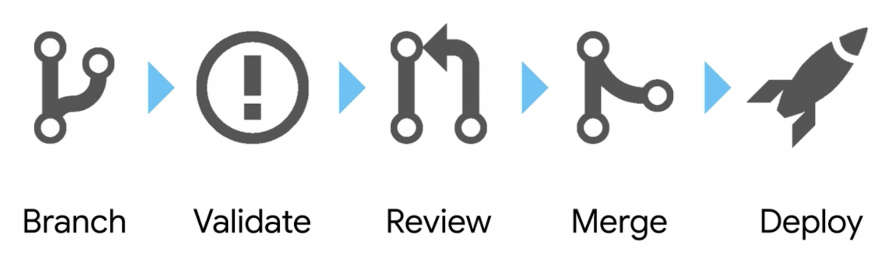

# CONTRIBUTING

Standard CICD / Git Common Workflow for Updating Repository

## Local Development Testing

1. Create Issue via Github, and if owning change - Update Owner and Label Metadata - [Managing labels](https://docs.github.com/en/github/managing-your-work-on-github/managing-labels)

1. Create Git Branch on Local Machine:
 `git checkout -b <branch-name>`
    > TIP: branch names should be prefixed with either `feat`, `bug` or `task` label, issue number and meaningful branch name to simplify tracking, i.e., `[feat|bug|task}-{issue-num}-{branch-name}`. For Example: `feat-101-traefik`,`bug-102-failed_regex`,`task-103-newroute`

1. Make changes to code locally, test against environment using `Makefile` targets
    > `ENVIRONMENT` is representative of the name of config folder
    1. Initialize CALM DSL Docker Container by running `make init-dsl-config ENVIRONMENT=kalm-main-{hpoc-id}`
    > For Example: `make init-dsl-config ENVIRONMENT=kalm-demo-16-2`
    1. Create DSL blueprint by running `make create-dsl-bps DSL_BP=<blueprint_name>`.
    > For Example: `make create-dsl-bps DSL_BP=karbon_cluster_deployment`
    1. Launch blueprint `make launch-dsl-bps DSL_BP=<blueprint_name>` using default test parameters found in `dsl/{blueprint_name}/tests/test_default_params.py`
    > For Example: `make create-dsl-bps DSL_BP=karbon_cluster_deployment`

1. Alternative, if working on helm chart blueprints
    1. Create HELM CHART DSL blueprint by running `make create-helm-bps CHART=<chart_name>`.
    > For Example: `make create-helm-bps CHART=kasten`
    1. Launch blueprint `make launch-helm-bps CHART=<chart_name>` using default test parameters found in `dsl/helm_charts/{chart_name}/tests/test_default_params.py`
    > For Example: `make launch-helm-bps CHART=kasten`

1. Make Code Updates and Frequently Commit changes
 `git add .`
 `git commit -am "fix: commit message"`

### Push Local Changes to Remote Repository

Now that you've completed your local development and testing, push up changes remotely and initiate a Pull Request from Feature Branch so that your code can be approved and merged into the main/master branch.

1. Push up changes to remote repository
`git push origin --set-upstream <branch-name>`

1. Pull Down Latest and Greatest from Main Branch to Resolve Trivial/Non-Trivial Conflicts
 `git pull origin main --rebase`

1. Initiate a Pull Request from Github Remote URL by clicking on `Compare & Pull Request` option. - https://github.com/nutanix-enterprise/shared-demo-karbon-calm

1. Upon Code Review from Peer - `Merge Pull Request` and `Delete Feature Branch`.

### Create Final Blueprint and Release/Publish to Marketplace

Now that you've got your latest changes into the `main/master` branch. Let's create our master blueprints and push into marketplace.

1. Checkout local `main` branch and pull down latest
    `git checkout main && git pull origin main`
1. Run `git rev-parse --short HEAD` to get short sha code from commit id (i.e., `e986938`).
1. Run `git tag --list` to get the last version released. (i.e, `v1.0.1-239d543`)
1. Increment Latest Version and tag `git tag v1.0.x-{short-sha-code}`.
    > For Example: `git tag v1.0.2-e986938`
1. Push local tag to remote rep - `git push origin --tags`
1. Create Master Blueprints and Publish Existing to Marketplace, using the following command:
    `make create-master-bps publish-existing-master-bps DSL_BP=karbon_cluster_deployment`
1. Create All Helm Chart Blueprints and Publish Existing to Marketplace, using the following command:
    `make create-all-helm-master-bps publish-all-existing-helm-bps`
1. `IF WORKING ON NEW HELM BP - OPTION B`. Create Single Helm Chart Blueprints and Publish New to Marketplace, using the following command:
    `make create-helm-master-bps publish-new-helm-bps CHART=<chart-name>`
1. `IF WORKING ON EXISTING HELM BP - OPTION B`. Create Single Helm Chart Blueprints and Publish Existing to Marketplace, using the following command:
    `make create-helm-master-bps publish-existing-helm-bps CHART=<chart-name>`