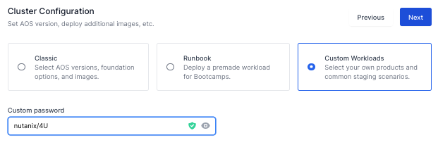
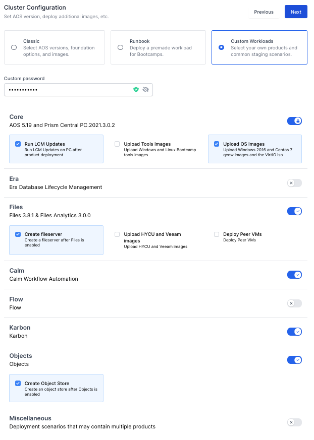
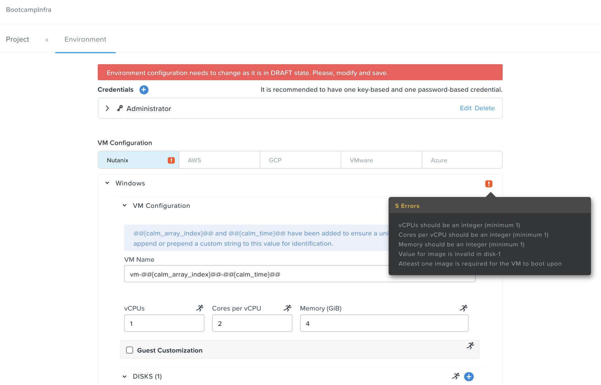
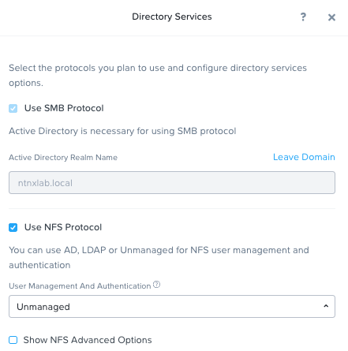
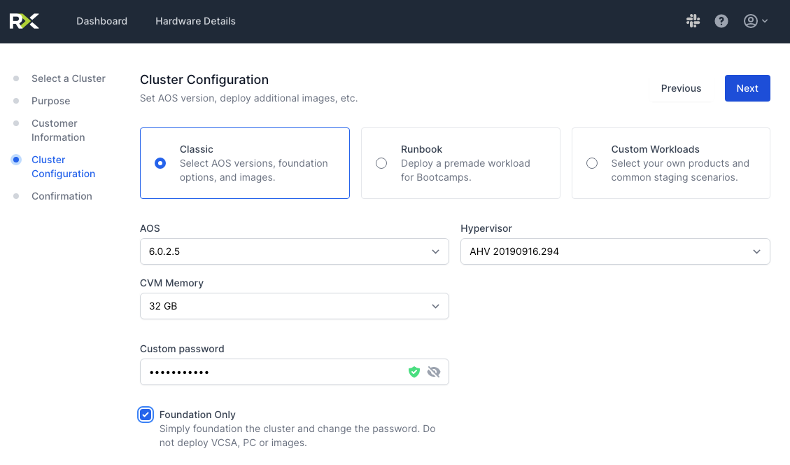
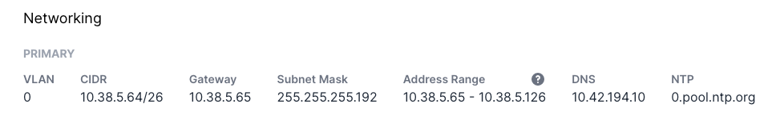
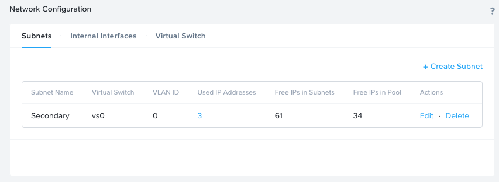

- [Bootstrapping a SingleNode HPOC - Kalm Environment](#bootstrapping-a-singlenode-hpoc---kalm-environment)
  - [Overall Workflow](#overall-workflow)
  - [Reserving Single Node HPOC Cluster](#reserving-single-node-hpoc-cluster)
  - [Bootstrap Calm Blueprints and Karbon Clusters - Single Node HPOC Cluster ONLY](#bootstrap-calm-blueprints-and-karbon-clusters---single-node-hpoc-cluster-only)
  - [Launch all available helm chart blueprints into Production Cluster](#launch-all-available-helm-chart-blueprints-into-production-cluster)
  - [Additional Manual Procedures](#additional-manual-procedures)
  - [Manual Staging of Additional Nutanix Services](#manual-staging-of-additional-nutanix-services)
    - [Configure Nutanix Files NFS (RWX Scenarios)](#configure-nutanix-files-nfs-rwx-scenarios)
  - [Alternative Scenarios](#alternative-scenarios)
    - [Adding Secondary AHV Cluster to existing Cluster](#adding-secondary-ahv-cluster-to-existing-cluster)

# Bootstrapping a SingleNode HPOC - Kalm Environment

The following procedures will bootstrap a newly provisioned SingleNode HPOC cluster.  

> WARNING: The `make bootstrap-kalm-all` target / scripts `WILL` attempt to `DELETE ALL EXISTING` apps, blueprints, endpoints, runbooks and marketplace items `ON EACH RUN`, so `RUN WITH CAUTION!!!`.

## Overall Workflow

1. [Reserving Single Node HPOC Cluster](#reserving-single-node-hpoc-cluster)
1. [Setup Local Development Environment](../README.md#setup-local-development-environment)
1. [Bootstrap Calm Blueprints and Karbon Clusters - Single Node HPOC Cluster ONLY](#bootstrap-calm-blueprints-and-karbon-clusters---single-node-hpoc-cluster-only)
1. [Optional - Launch all available helm chart blueprints into Production Cluster](#optional-launch-all-available-helm-chart-blueprints-into-production-cluster)

## Reserving Single Node HPOC Cluster

1. Navigate to `https://rx.corp.nutanix.com/` hpoc reservation site and reserve cluster a single node hpoc (i.e., PHX-SPOC011-2) cluster.  This process takes roughly 3 hours to complete, but can be reserved on-demand or scheduled in advance.

    > `TIP 1`: During your reservation, set password to something you're familiar with as to avoid having to update creds within `.local\<environment>` path
        

    > `TIP 2`: Select the `Custom Workloads` option, and select the following options to ensure that you can start with a baseline deplyment of Objects, Calm, Karbon and Files:
        - `Core: Run LCM Updates & Upload OS Images`
        - `Files: Create File Server` - Needed for NFS Exports / ReadWriteMany PV Scenarios
        - `Calm`
        - `Karbon`
        - `Objects: Create Object Store` - Needed for Kasten Scenarios.
        

## Bootstrap Calm Blueprints and Karbon Clusters - Single Node HPOC Cluster ONLY

1. Bootstrap Nutanix Calm & Karbon `Production` (i.e., `kalm-main-{hpoc_id}`) Infratructure. [Additional Details](#bootstrapping-calm-blueprints--marketplace--karbon-kalm-main-hpoc-id-cluster)

    `make bootstrap-kalm-all ENVIRONMENT=kalm-main-{hpoc_id}`
    > EXAMPLE: `make bootstrap-kalm-all ENVIRONMENT=kalm-main-11-2`

## Launch all available helm chart blueprints into Production Cluster

1. Provision all available helm chart blueprints into `Production` (i.e., `kalm-main-{hpoc_id}`) cluster using test parameters

    `make launch-all-helm-charts ENVIRONMENT=kalm-main-{hpoc_id}`
    > EXAMPLE: `make launch-all-helm-charts ENVIRONMENT=kalm-main-11-2`

## Additional Manual Procedures

1. [Optional] - Configure Project `Environment` tab (e.g., credentials, vcpu, memory, image, etc.) to ensure that Launching of Marketplace Items are successful.

    

## Manual Staging of Additional Nutanix Services

### Configure Nutanix Files NFS (RWX Scenarios)

1. Configure NFS Protocol / Export to be leveraged by Karbon
    
1. Configure NFS Export with Whitelist for Subnet to be leveraged by Karbon Static NFS Use Case

## Alternative Scenarios

### Adding Secondary AHV Cluster to existing Cluster

If you need additional capacity to deploy more clusters (i.e., DR scenario), you can deploy a secondary Single-Node HPOC and Select the "Classic" Option

1. Reserve Additional Single Node HPOC Cluster and Select the `Classic` Option, Set the Password to be the same as existing PC cluster, and Enable the `Foundation Only` Checkbox
  
1. Identify DHCP Range for target cluster, which can be found on `RX Dashboard`
  
1. Identify existing cluster's DNS Server IP to re-use, typically labeled as `autoad` VM in existing instance.
1. Create `Secondary` subnet with appropriate range - and leverage DNS server from Existing Cluster. (HINT: If stuck, use `Primary` Network DNS Settings as example)
  
1. On completion, `Register PE Cluster` to Existing Prism Central Instance (standard workflow)
1. Create environment specific `configs/.local` directories as you've done previously, and update `.env` file with configs to override. See `docs/examples/secondary-ahv-cluster.env` as example
   1. Run `make print-vars` and `make print-secrets` to make sure configs looks correct.

